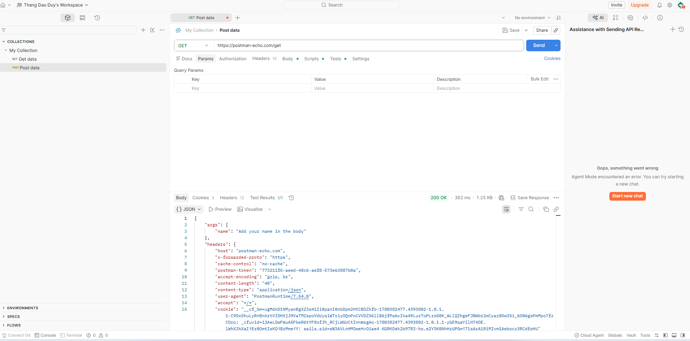
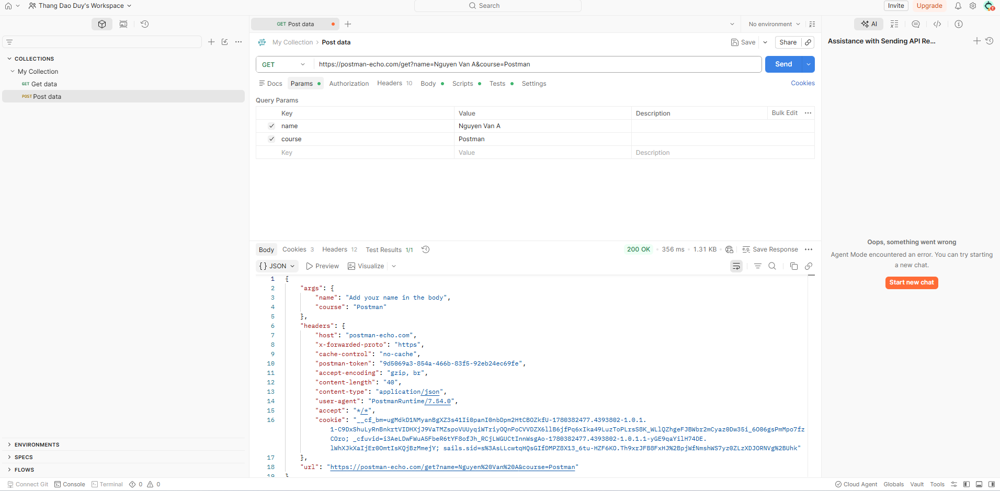
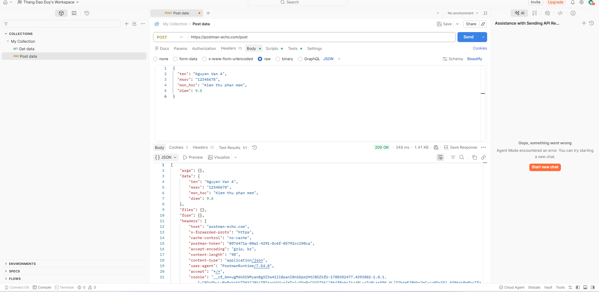
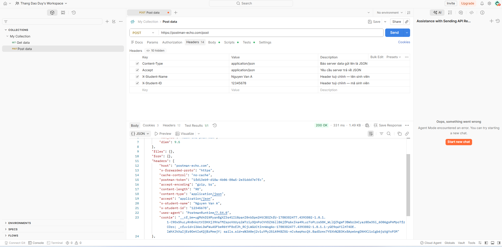
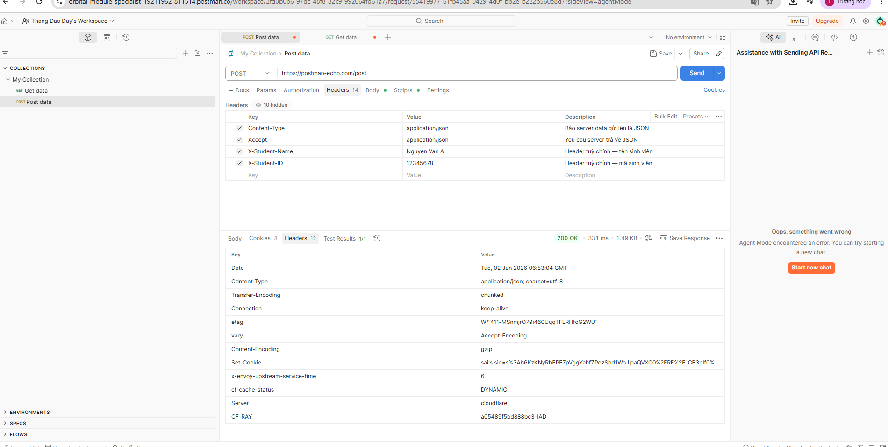
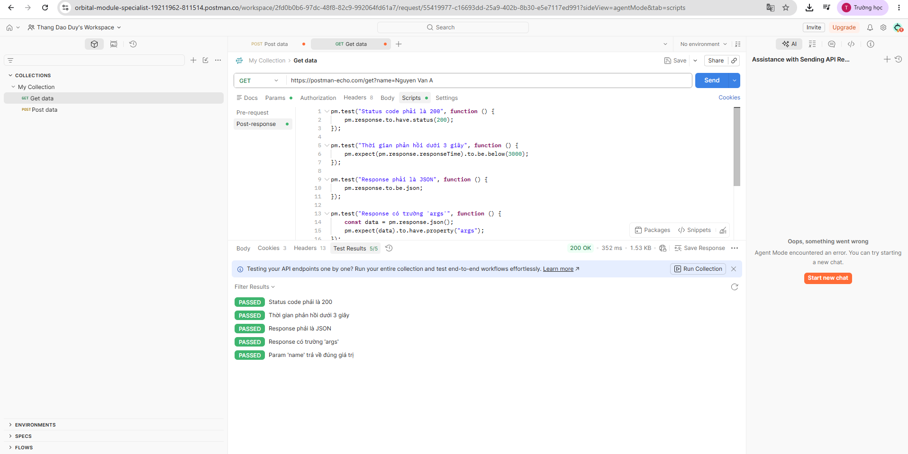
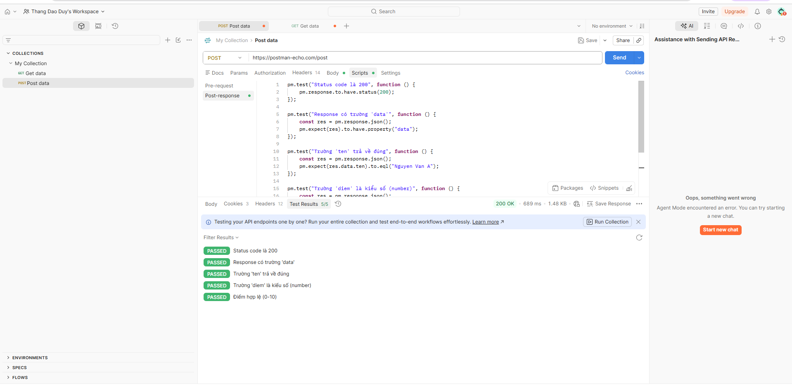
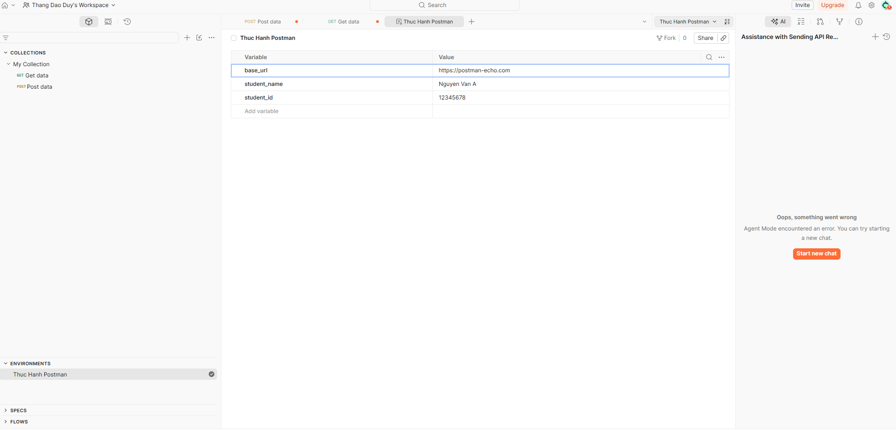
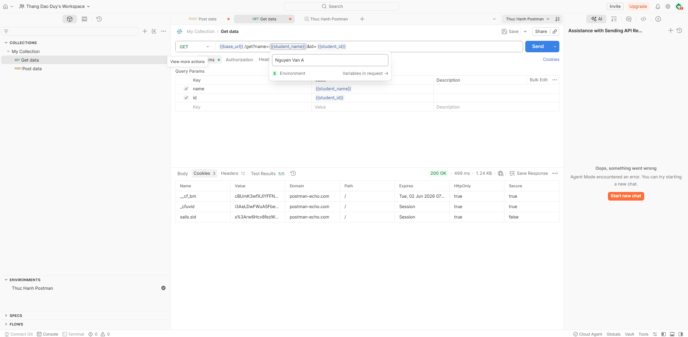

# BÁO CÁO THỰC HÀNH: TÌM HIỂU VÀ KIỂM THỬ API VỚI CÔNG CỤ POSTMAN

## I. MỤC TIÊU BÀI THỰC HÀNH
1. Sử dụng thành thạo các thành phần giao diện của Postman: Collections, Requests, Params, Headers, Body, Scripts, và Environments.
2. Thực hành và nắm rõ cơ chế hoạt động, sự khác biệt bản chất của các phương thức HTTP cốt lõi: `GET`, `POST`, `PUT`, `PATCH`, và `DELETE`.
3. Biết cách tổ chức dữ liệu truyền đi qua Tham số truy vấn (Query Params), Tiêu đề tùy chỉnh (Custom Headers) và Dữ liệu cấu trúc (Request Body JSON).
4. Viết kịch bản kiểm thử tự động bằng ngôn ngữ JavaScript thông qua thư viện tích hợp đối tượng `pm.test` để kiểm tra dữ liệu phản hồi (Response Assertion).
5. Quản lý và sử dụng Biến môi trường (Environment Variables) để tối ưu hóa, tăng tính linh hoạt và chuyên nghiệp cho bộ script kiểm thử.

---

## II. NGHIÊN CỨU CHUYÊN SÂU: CÁC PHƯƠNG THỨC HTTP NÂNG CAO (PUT, PATCH, DELETE)

Bên cạnh `GET` (Lấy dữ liệu) và `POST` (Tạo mới dữ liệu) được minh họa bằng hình ảnh, quy trình kiểm thử API thực tế đòi hỏi việc thao tác toàn diện vòng đời dữ liệu (CRUD) thông qua 3 phương thức quan trọng sau:

### 1. Phương thức PUT (Thay thế toàn bộ tài nguyên - Toàn phần)
- **Khái niệm:** Được sử dụng để cập nhật một tài nguyên hiện có bằng cách **thay thế hoàn toàn** thực thể cũ bằng một payload dữ liệu mới. Nếu tài nguyên chưa tồn tại, tùy theo thiết kế hệ thống, PUT có thể tạo mới tài nguyên đó.
- **Tính chất (Idempotent):** PUT có tính **Idempotent (Đồng nhất)**. Nghĩa là việc gửi một yêu cầu PUT giống nhau nhiều lần liên tiếp sẽ tạo ra kết quả trên hệ thống tương đương với việc chỉ gửi một lần duy nhất.
- **Cấu hình trong Postman:** - Chọn Method: `PUT`
  - Body (raw - JSON): Bắt buộc phải truyền lên **đầy đủ tất cả các thuộc tính** của đối tượng, kể cả những trường không thay đổi. Nếu thiếu trường, các trường đó có thể bị ghi đè thành rỗng (`null` hoặc mặc định).
- **Ví dụ Payload cập nhật thông tin sinh viên:**
  ```json
  {
    "id": 101,
    "ten": "Nguyen Van A",
    "mssv": "12345678",
    "mon_hoc": "Kiem thu phan mem nâng cao",
    "diem": 10.0
  }
  ```
- **Kịch bản Test Script mẫu:**
  ```javascript
  pm.test("PUT thành công - Status 200 OK", function () {
      pm.response.to.have.status(200);
  });
  ```

### 2. Phương thức PATCH (Cập nhật một phần tài nguyên - Cục bộ)
- **Khái niệm:** Được sử dụng để thay đổi, cập nhật **một hoặc một vài thuộc tính cụ thể** của tài nguyên mà không làm ảnh hưởng đến các trường thông tin khác.
- **Sự khác biệt với PUT:** PUT yêu cầu gửi toàn bộ đối tượng, trong khi PATCH tối ưu hơn về băng thông vì chỉ yêu cầu gửi đi các cặp thuộc tính cần chỉnh sửa.
- **Tính chất (Non-idempotent):** PATCH không hoàn toàn mang tính Idempotent tùy thuộc vào cách triển khai phía server (ví dụ: lệnh PATCH tăng tiến một giá trị số sẽ làm thay đổi trạng thái sau mỗi lần gọi).
- **Cấu hình trong Postman:**
  - Chọn Method: `PATCH`
  - Body (raw - JSON): Chỉ truyền trường cần đổi màu, sửa chữ.
- **Ví dụ Payload (Chỉ cập nhật lại riêng điểm số của sinh viên):**
  ```json
  {
    "diem": 9.8
  }
  ```
- **Kịch bản Test Script mẫu:**
  ```javascript
  pm.test("PATCH thành công - Kiểm tra trường điểm được cập nhật", function () {
      const res = pm.response.json();
      pm.expect(res.data.diem).to.eql(9.8);
  });
  ```

### 3. Phương thức DELETE (Xóa tài nguyên)
- **Khái niệm:** Được sử dụng để gỡ bỏ hoặc xóa hoàn toàn một tài nguyên cụ thể ra khỏi cơ sở dữ liệu của hệ thống.
- **Tính chất (Idempotent):** DELETE là phương thức **Idempotent**. Lần gọi đầu tiên sẽ xóa tài nguyên và trả về thành công (thường là `200 OK` hoặc `204 No Content`). Các lần gọi tiếp theo hệ thống không thay đổi thêm gì nữa, máy chủ sẽ trả về lỗi không tìm thấy (`404 Not Found`).
- **Cấu hình trong Postman:**
  - Chọn Method: `DELETE`
  - Thường không truyền gói dữ liệu Body, thay vào đó định danh tài nguyên cần xóa sẽ được chỉ định trực tiếp trên URL dưới dạng Path Parameter (ví dụ: `{{base_url}}/delete/101`) hoặc Query Parameter.
- **Kịch bản Test Script mẫu:**
  ```javascript
  pm.test("DELETE thành công - Trạng thái 200 hoặc 204", function () {
      pm.expect(pm.response.code).to.be.oneOf([200, 204]);
  });
  ```

---

## III. CHI TIẾT THỰC HIỆN VÀ KẾT QUẢ 

### Áp dụng Biến môi trường vào cấu trúc Request GET động
- **Mô tả:** Thay thế đường dẫn và tham số tĩnh bằng cách liên kết trực tiếp tới các biến môi trường để tạo request động linh hoạt.
- **Thao tác thực hiện:** Chọn môi trường hoạt động là "Thuc Hanh Postman". Thay đổi URL và tham số theo cú pháp dấu ngoặc nhọn kép: `{{base_url}}/get?name={{student_name}}&id={{student_id}}`. Rê chuột (Hover) qua các biến để kiểm tra giá trị phân giải động (Tooltip).
- **Kết quả:** Hệ thống tự động biên dịch chính xác các biến môi trường thành dữ liệu thực tế (`Nguyen Van A`, `12345678`) khi gửi yêu cầu. Máy chủ phản hồi thành công và trả về dữ liệu tương ứng.
- **Hình ảnh minh họa:**


---

### Thiết lập và Quản lý Biến môi trường (Environment Variables)
- **Mô tả:** Khởi tạo một không gian môi trường chuyên biệt để lưu trữ tập trung các cấu hình hệ thống, tránh việc viết cứng dữ liệu (Hard-coded).
- **Thao tác thực hiện:** Vào mục **Environments**, tạo một môi trường mới tên là **"Thuc Hanh Postman"**. Định nghĩa và gán giá trị khởi tạo ban đầu cho các biến thành phần:
  - `base_url`: `https://postman-echo.com`
  - `student_name`: `Nguyen Van A`
  - `student_id`: `12345678`
- **Kết quả:** Bộ biến môi trường được lưu trữ thành công, sẵn sàng cung cấp dữ liệu động cho toàn bộ các request trong không gian làm việc (Workspace).
- **Hình ảnh minh họa:**


---

### Xây dựng Script kiểm thử tự động cho Request POST
- **Mô tả:** Lập trình kịch bản kiểm thử tự động cho phương thức POST nhằm xác thực cấu trúc dữ liệu phản hồi và logic nghiệp vụ liên quan đến thông tin sinh viên.
- **Thao tác thực hiện:** Tại tab **Scripts** -> mục **Post-response** của request POST, viết mã script JavaScript để kiểm tra 5 tiêu chí: Mã trạng thái 200, tồn tại trường `data`, giá trị trường `ten` phải đúng, trường `diem` phải là kiểu số, và điểm số phải nằm trong khoảng từ 0 đến 10.
- **Mã kịch bản kiểm thử:**
  ```javascript
  pm.test("Status code là 200", function () {
      pm.response.to.have.status(200);
  });
  pm.test("Response có trường 'data'", function () {
      const res = pm.response.json();
      pm.expect(res).to.have.property("data");
  });
  pm.test("Trường 'ten' trả về đúng", function () {
      const res = pm.response.json();
      pm.expect(res.data.ten).to.eql("Nguyen Van A");
  });
  pm.test("Trường 'diem' là kiểu số (number)", function () {
      const res = pm.response.json();
      pm.expect(res.data.diem).to.be.a("number");
  });
  pm.test("Điểm hợp lệ (0-10)", function () {
      const res = pm.response.json();
      pm.expect(res.data.diem).to.be.within(0, 10);
  });
  ```
- **Kết quả:** Tab **Test Results** hiển thị trạng thái `5/5 PASSED` màu xanh lục. Toàn bộ các ca kiểm thử nghiệp vụ đều vượt qua thành công.
- **Hình ảnh minh họa:**


---

### Cấu hình Custom Headers cho Request POST
- **Mô tả:** Thiết lập các trường tiêu đề tùy chỉnh (Custom Headers) để đính kèm siêu dữ liệu (Metadata) định danh sinh viên vào gói tin HTTP gửi đi.
- **Thao tác thực hiện:** Tại tab **Headers** của Request, thêm các cặp Key - Value:
  - `Content-Type`: `application/json` (Báo cho server biết dữ liệu gửi lên là JSON)
  - `Accept`: `application/json` (Yêu cầu server trả về định dạng JSON)
  - `X-Student-Name`: `Nguyen Van A` (Tên sinh viên)
  - `X-Student-ID`: `12345678` (Mã sinh viên)
- **Kết quả:** Cấu hình thành công, sẵn sàng vận chuyển thông tin định danh đi kèm yêu cầu.
- **Hình ảnh minh họa:**


---

### Xây dựng Script kiểm thử tự động cho Request GET
- **Mô tả:** Viết mã kiểm thử tự động bằng ngôn ngữ JavaScript để tự động hóa khâu đánh giá chất lượng phản hồi đối với phương thức GET.
- **Thao tác thực hiện:** Tại tab **Scripts** -> mục **Post-response** của request GET, viết mã khẳng định (Assertion) để kiểm tra: Mã trạng thái phản hồi bằng 200, thời gian phản hồi dưới 3 giây, phản hồi dạng JSON, có chứa trường `args`, và tham số `name` trả về chính xác.
- **Mã kịch bản kiểm thử:**
  ```javascript
  pm.test("Status code phải là 200", function () {
      pm.response.to.have.status(200);
  });
  pm.test("Thời gian phản hồi dưới 3 giây", function () {
      pm.expect(pm.response.responseTime).to.be.below(3000);
  });
  pm.test("Response phải là JSON", function () {
      pm.response.to.be.json;
  });
  pm.test("Response có trường 'args'", function () {
      const data = pm.response.json();
      pm.expect(data).to.have.property("args");
  });
  pm.test("Param 'name' trả về đúng giá trị", function () {
      const data = pm.response.json();
      pm.expect(data.args.name).to.eql("Nguyen Van A");
  });
  ```
- **Kết quả:** Tab **Test Results** trả về thông báo trạng thái `5/5 PASSED`. Bộ kịch bản xác thực hoạt động hoàn hảo.
- **Hình ảnh minh họa:**


---

### Kiểm tra phản hồi siêu dữ liệu (Response Headers) từ Máy chủ
- **Mô tả:** Xem xét phần tiêu đề phản hồi (Response Headers) được trả về từ phía server sau khi thực hiện gửi request POST để xác minh các thuộc tính hệ thống.
- **Thao tác thực hiện:** Nhấn gửi Request POST, sau đó kiểm tra thông tin hiển thị tại tab **Headers** thuộc vùng hiển thị Response ở phía dưới màn hình.
- **Kết quả:** Máy chủ phản hồi đầy đủ các thông tin như `Date`, `Content-Type: application/json; charset=utf-8`, `Connection`, `Server (cloudflare)` và ghi nhận chính xác các custom headers của sinh viên truyền lên trong mục dữ liệu phân tích.
- **Hình ảnh minh họa:**


---

### Truyền dữ liệu cấu trúc JSON qua Request Body (Phương thức POST)
- **Mô tả:** Thực hiện đóng gói và truyền tải một tập payload dữ liệu phức tạp (thông tin sinh viên và điểm số) lên máy chủ dưới định dạng cấu trúc JSON.
- **Thao tác thực hiện:** Tại tab **Body** của request POST, chọn kiểu nhập dữ liệu là **raw**, chuyển định dạng văn bản sang cấu trúc **JSON**. Tiến hành soạn thảo chuỗi đối tượng sinh viên:
  ```json
  {
    "ten": "Nguyen Van A",
    "mssv": "12345678",
    "mon_hoc": "Kiem thu phan mem",
    "diem": 9.5
  }
  ```
- **Kết quả:** Gửi yêu cầu thành công, nhận mã trạng thái `200 OK`. Toàn bộ nội dung JSON được máy chủ tiếp nhận xử lý và phản hồi nhân bản (echo) lại nguyên vẹn trong đối tượng thuộc tính `data` của Response Body.
- **Hình ảnh minh họa:**


---

### Sử dụng Tham số truy vấn (Query Parameters) trong Request GET
- **Mô tả:** Thực hiện truyền thêm các tham số trực tiếp trên đường dẫn URL phục vụ mục đích tìm kiếm, lọc dữ liệu trên máy chủ.
- **Thao tác thực hiện:** Tại tab **Params** của request GET, khai báo bổ sung các cặp Key - Value:
  - `name`: `Nguyen Van A`
  - `course`: `Postman`
- **Kết quả:** Đường dẫn URL tự động cập nhật đồng bộ thành `https://postman-echo.com/get?name=Nguyen Van A&course=Postman`. Máy chủ tiếp nhận thành công các tham số này và đóng gói trả về chính xác trong trường `args`.
- **Hình ảnh minh họa:**


---

### Khởi tạo và gửi Request GET cơ bản ban đầu
- **Mô tả:** Làm quen với giao diện Postman bằng cách gửi một yêu cầu HTTP phương thức `GET` cơ bản nhất lên máy chủ công khai của Postman Echo.
- **Thao tác thực hiện:** Tạo một Request mới, thiết lập phương thức là `GET`, nhập địa chỉ URL endpoint: `https://postman-echo.com/get` và nhấn nút **Send**.
- **Kết quả:** Yêu cầu được gửi đi suôn sẻ, máy chủ trả về mã thành công `200 OK` cùng nội dung phản hồi mặc định dạng JSON chứa các thông tin tổng quan của yêu cầu vừa gửi.
- **Hình ảnh minh họa:**


---

## IV. TỔNG KẾT VÀ ĐÁNH GIÁ BÀI THỰC HÀNH
Thông qua chuỗi 9 bước học tập thực tế và phần mở rộng lý thuyết, em đã đạt được các kết quả quan trọng sau:
- **Về lý thuyết & giao thức:** Làm chủ toàn bộ vòng đời CRUD của một API thông qua các phương thức cốt lõi: `GET` (Đọc dữ liệu), `POST` (Tạo dữ liệu), `PUT` (Cập nhật toàn phần), `PATCH` (Cập nhật một phần) và `DELETE` (Xóa dữ liệu). Phân biệt rõ ràng tính chất **Idempotent** của từng phương thức để thiết kế kịch bản test chuẩn xác.
- **Về kỹ năng kiểm thử:** Làm chủ tư duy và kỹ thuật viết kịch bản kiểm thử tự động (Automation Testing Script) dựa trên các câu lệnh khẳng định Assertion của thư viện Postman. Giúp tối ưu hóa năng suất kiểm thử, giảm sai sót thủ công và hỗ trợ đắc lực cho quy trình chạy kiểm thử hồi quy (Regression Testing).
- **Về quản lý dự án chuyên nghiệp:** Biết cách quản trị biến môi trường (Environment), tách biệt dữ liệu cấu hình khỏi mã nguồn tĩnh. Đây là nền tảng cốt lõi giúp chuẩn hóa bộ kiểm thử để dễ dàng tích hợp vào hệ thống tự động hóa CI/CD trong thực tế.
